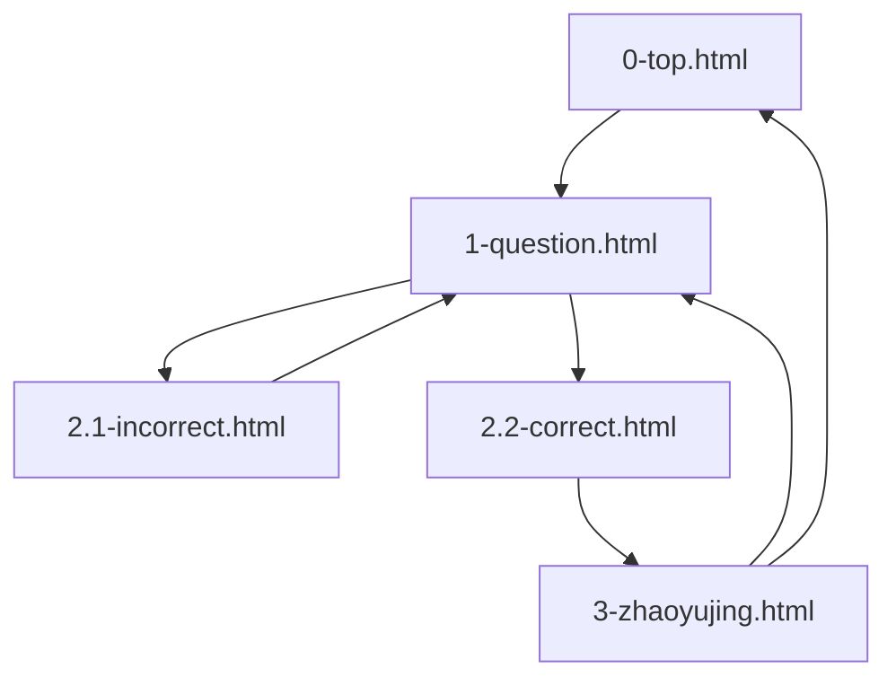

# 説明

本ドキュメントは、制作したWebページの構成および工夫点をまとめた説明書です。

## 目次
(ページ中の特定場所へのジャンプ)
- [画面一覧表](#画面一覧表)
- [工夫したこと](#工夫したこと)  
  
---

## 画面一覧表

|No.|ファイル名|内容|遷移|
|:-------------|:------------:|:------------:|:-------------|
|0|top.html|始まり|0|
|1|question.html|クイズページ|0-1|
|2.1|incorrect.html| 不正解の場合|0-1-2.1|
|2.2|correct.html| 正解の場合|0-1-2.2|
|3|zhaoyujing.html| 自己紹介|0-1-2.2-3|
|4.1|zhaoyujing.css|仕様|なし|
|4.2|zhaoyujing.js|振る舞い|なし|

---

## 工夫したこと

### 1. 可読性とメンテナンス性の向上
- **コード機能別管理：**　HTML、CSS、JavaScriptのファイルを役割ごとにしっかり分離しました。
- **コメント付き、コードの読みやすさ：** CSSやJSのファイル内に「どの画面の処理か」「何の機能か」を細かくコメントで書きました。
- **作業効率と保守性：** 実際の開発現場て、コメント、機能別コード書くことがあったと後から保守する際や他人が修正する際も意図がすぐに伝わり、理解にかかる時間や修正ミスの手間を削減できます。

### 2. CSSを活用した見やすいレイアウト
- `display: flex` を活用し、要素の中央揃えや均等配置を少ないコードで実現しました。
- ページ全体の色調（緑系）をCSSで統一管理し、デザインの変更をしやすくしました。

### 3. JavaScriptによる動的なギミック実装
- `alert` を使って、クイズの難易度に合わせて段階的にヒントを表示するボタン（`Hit1`〜`Hit3`）と、一括表示（`Hit_all`）、解答表示（`Answer`）の機能をJavaScriptで実装しました。
---
2026年09月15日  
ZHAO YUJING
